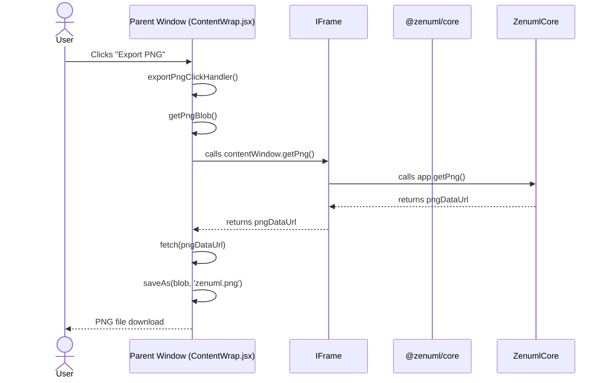

# ZenUML Web Sequence - PNG Export and iframe Architecture Analysis

## 1. Overview

ZenUML Web Sequence uses an iframe architecture to render sequence diagrams and implements PNG export functionality through the `toBlob()` method provided by the @zenuml/core library. This document provides a detailed analysis of these two core mechanisms.

## 2. PNG Export Mechanism

### 2.1 Export Flow

The complete PNG export flow is as follows:

1.  **User Triggers Export**
    *   Click download button triggers `exportPngClickHandler()` (ContentWrap.jsx:540)
    *   Or click copy button triggers `copyImageClickHandler()` (ContentWrap.jsx:559)

2.  **Permission Check**
    ```javascript
    if (!window.user) {
      this.props.onLogin();
      return;
    }
    ```

3.  **Get PNG Blob**
    ```javascript
    async getPngBlob() {
      // Use the getPng method exposed by the iframe
      const pngDataUrl = await this.frame.contentWindow.getPng();
      if (!pngDataUrl) {
        throw new Error('Failed to get PNG from diagram');
      }
      
      // Convert data URL to Blob
      const response = await fetch(pngDataUrl);
      return await response.blob();
    }
    ```

4.  **Process Export**
    *   Download: Uses FileSaver.js's `saveAs(png, 'zenuml.png')`
    *   Copy: Uses Clipboard API to write to clipboard

### 2.2 Key Technical Points

1.  **Official API Method**: Uses the `getPng()` method provided by @zenuml/core library
2.  **Data URL to Blob Conversion**: The `getPng()` method returns a data URL which is converted to Blob using the Fetch API
3.  **Cross-iframe Access**: Access iframe's exposed methods through `this.frame.contentWindow`
4.  **No Vue Internals**: No longer relies on accessing Vue instance internals (`__vue__`), making it more stable and future-proof

### 2.3 Chrome Extension Special Handling

Chrome extension uses a different screenshot mechanism (takeScreenshot.js):
- Uses Chrome tabs API for screenshots
- Saves to filesystem through WriteFile.js

## 3. iframe Architecture Analysis

### 3.1 iframe Creation

The iframe is created in ContentWrap.jsx:
```jsx
<iframe
  ref={(el) => (this.frame = el)}
  frameBorder="0"
  id="demo-frame"
  allowFullScreen
/>
```

### 3.2 Content Loading Process

1.  **HTML Template Generation** (computes.js:13-19)
    ```javascript
    var code = `<main id="demo">
      <div id="diagram">
        <div id="mounting-point">
          <seq-diagram></seq-diagram>
        </div>
      </div>
    </main>`;
    ```

2.  **Complete HTML Assembly** (utils.js - getCompleteHtml)
    *   Creates complete HTML document structure
    *   Injects CSS styles
    *   **Loads ZenUML Core library**: `<script src="' + getUrl(zenumlUrl) + '"></script>`
    *   zenumlUrl is imported via Vite's URL import feature: `import zenumlUrl from '@zenuml/core/dist/zenuml?url'`

3.  **JavaScript Initialization** (computes.js:170-192)
    ```javascript
    window.addEventListener("load", function(event) {
      window.app = new window.zenuml.default('#mounting-point')
      // Expose getPng method to parent window
      window.getPng = async function() {
        if (window.app) {
          return await window.app.getPng();
        }
        return null;
      };
    });
    ```

4.  **Content Setting**
    *   Prefers `srcdoc` attribute (modern browsers)
    *   Falls back to `document.write` (older browsers)

### 3.3 Communication Mechanism

#### Parent Window to iframe

```javascript
// ContentWrap.jsx
targetWindow.postMessage({ code: this.cmCodes.js }, '*');
```

#### iframe Listener

```javascript
// computes.js
window.addEventListener('message', (e) => {
  const code = e.data && e.data.code;
  const cursor = e.data && e.data.cursor;
  
  if (code && app) {
    app.render(code, {
      enableMultiTheme: false,
      theme: "theme-default",
      onContentChange: (code) => {
        window.parent.postMessage({ code })
      },
      stickyOffset: Number(new URLSearchParams(window.location.search).get('stickyOffset') || 0)
    });
  }
});
```

### 3.4 Key Features

1.  **Real-time Synchronization**: Changes in the editor are reflected in the preview in real-time via postMessage
2.  **Detached Window Support**: Supports opening preview in a separate window (detachPreview)
3.  **Cursor Synchronization**: Cursor position synchronization between editor and preview
4.  **Security Considerations**:
    *   Uses srcdoc instead of data URL (more secure)
    *   Communicates via postMessage API
    *   Dynamically generates content to prevent XSS attacks

## 4. Architecture Advantages

1.  **Isolation**: Complete isolation between editor UI and rendering engine
2.  **Flexibility**: Supports advanced features like detached windows and real-time preview
3.  **Maintainability**: Clear modular design
4.  **Security**: iframe provides a natural sandbox environment

## 5. Potential Improvements

1.  **PNG Export Dependency**: Currently relies on accessing Vue instance's internal property (__vue__), which may fail when Vue version updates
2.  **Cross-origin Restrictions**: iframe communication uses `*` as target origin, could consider restricting to specific domains
3.  **Error Handling**: Could enhance error handling and user feedback when PNG export fails

## 6. Summary

ZenUML Web Sequence achieves effective isolation between the editor and rendering engine through its iframe architecture, while leveraging the toBlob() method provided by @zenuml/core for efficient PNG export functionality. This design ensures system modularity and security while providing a good user experience.

## 7. PNG Export Sequence Diagram


